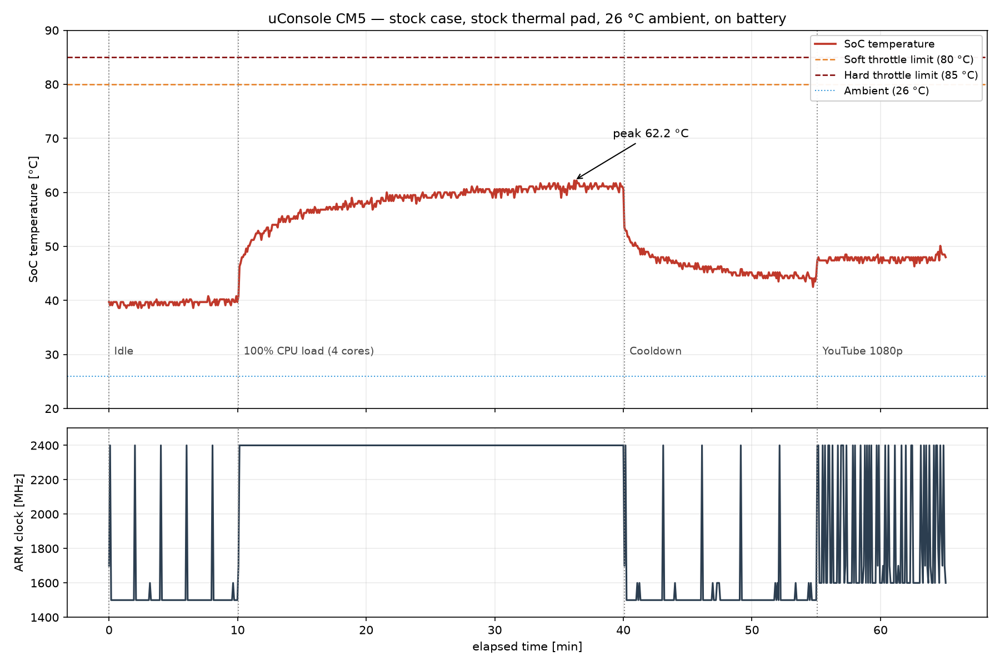

# uConsole CM5 Thermal Test - raw data

Raw measurements behind the article **[uConsole CM5 Thermal Test: Does It Throttle Without Extra Cooling?](https://sapsan-sklep.pl/en/blogs/articles/uconsole-cm5-thermal-test-throttling)**

**Short answer: no.** A Compute Module 5 in a stock, closed uConsole case on the factory thermal pad peaked at **62.2 °C** after 30 minutes at 100% on all four cores, and the kernel throttle register read `0x0` for the entire 65-minute session.



## Test conditions

| | |
|---|---|
| Device | ClockworkPi uConsole, stock case **closed**, factory ClockworkPi thermal pad, no modifications |
| Module | Raspberry Pi Compute Module 5 Lite Rev 1.0, 8 GB RAM |
| OS | Debian GNU/Linux 12 (bookworm), kernel 6.12.94-v8-16k+ |
| CPU governor | `ondemand` (factory default, unchanged) |
| Screen backlight | maximum (9/9) |
| Ambient | 26 °C (room thermometer read 25.9-26.4 °C throughout) |
| Power | **battery, charger unplugged** (99% → 68%) |
| Sampling | every 5 s, 773 samples total |
| Date | 2026-07-27 |

Charging draws 1.6 A and heats the case from the inside, so the entire test was run on battery.

## Results

| Phase | Duration | Mean | Peak | Mean ARM clock | Throttled |
|---|---|---|---|---|---|
| Idle | 10 min | 39.6 °C | 40.8 °C | 1541 MHz | `0x0` |
| **100% CPU, 4 cores** | **30 min** | **58.4 °C** | **62.2 °C** | **2398 MHz** | **`0x0`** |
| Cooldown | 15 min | - | 60.6 → 44.6 °C | 1500 MHz | `0x0` |
| YouTube 1080p | 10 min | 47.7 °C | 50.1 °C | 1862 MHz | `0x0` |

Temperature ramp under full load: 50.7 °C at 1 min, 55.1 at 5 min, 57.9 at 10 min, 60.6 from 20 min onward. The curve reaches 95% of its peak at 11 minutes.

The ARM clock held 2400 MHz for **99.7% of samples** during the CPU phase. Sustained throttling would show as a downward drift; there is none.

## Load used

- CPU phase: `stress-ng --cpu 4 --cpu-method matrixprod --timeout 1800s`
- Video phase: YouTube 1080p in Chromium, full screen, one complete playback of *Big Buck Bunny* (video ID `YE7VzlLtp-4`, Blender Foundation, Creative Commons)

## Repository layout

```
data/           CSV, one file per phase
scripts/        logger, on-screen monitor, screenshot loop, chart generator
screenshots/    30 screenshots captured during the run, filename carries phase, time and SoC temperature
```

### CSV columns

`t_s, phase, temp_c, arm_hz, core_v, throttled, load1, batt_pct, batt_uv`

`throttled` is the raw value of `vcgencmd get_throttled`:

| bit | meaning (now) | bit | meaning (since boot) |
|---|---|---|---|
| 0 (`0x1`) | undervoltage | 16 (`0x10000`) | undervoltage occurred |
| 1 (`0x2`) | ARM frequency capped | 17 (`0x20000`) | capping occurred |
| 2 (`0x4`) | currently throttled | 18 (`0x40000`) | throttling occurred |
| 3 (`0x8`) | soft temperature limit active | 19 (`0x80000`) | soft limit occurred |

Every sample in this dataset reads `0x0`.

## Reproducing the test

```bash
sudo apt install stress-ng
./scripts/thermal-log.sh idle 600
./scripts/thermal-log.sh stress 1800 &   # alongside: stress-ng --cpu 4 --cpu-method matrixprod --timeout 1800s
./scripts/thermal-log.sh cooldown 900
./scripts/thermal-log.sh video 600
python3 scripts/plot_thermal.py
```

Report the ambient temperature with your results - the equilibrium is a delta above ambient, not an absolute value.

## Limitations

- One unit, one ambient temperature (26 °C)
- The thermal pad thickness was **not** measured - we measured its effect, not its cause
- No comparison run with the case open, with a riser or with a thinner pad
- `stress-ng --cpu 4` is a synthetic CPU load and does not exercise the GPU
- Stock configuration throughout

## License

Data and scripts: [CC BY 4.0](https://creativecommons.org/licenses/by/4.0/). Use them, publish them, build on them - please link back.

Measured and published by [SAPSAN](https://sapsan-sklep.pl/en), which also sells the [uConsole Kit RPI-CM5 8GB](https://sapsan-sklep.pl/en/products/uconsole-kit-cm5) and the [Raspberry Pi Compute Module 5](https://sapsan-sklep.pl/en/products/raspberry-pi-cm5-8gb-lite). We publish the raw data precisely so the numbers can be checked rather than taken on trust.
